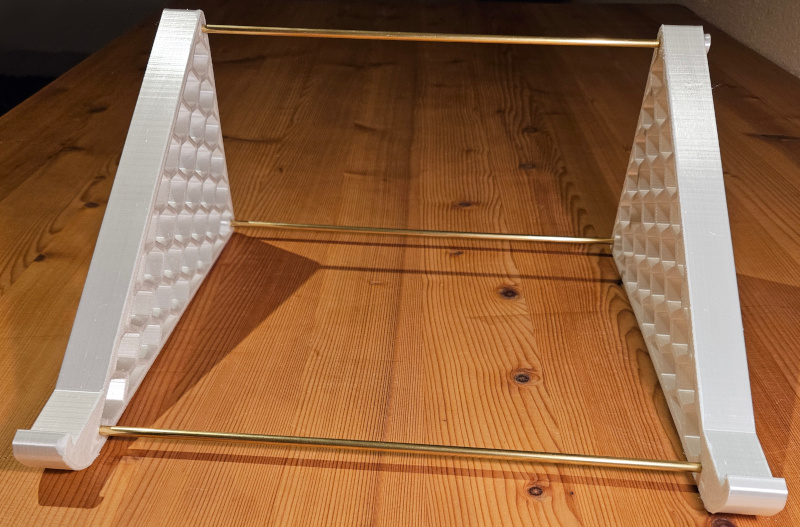
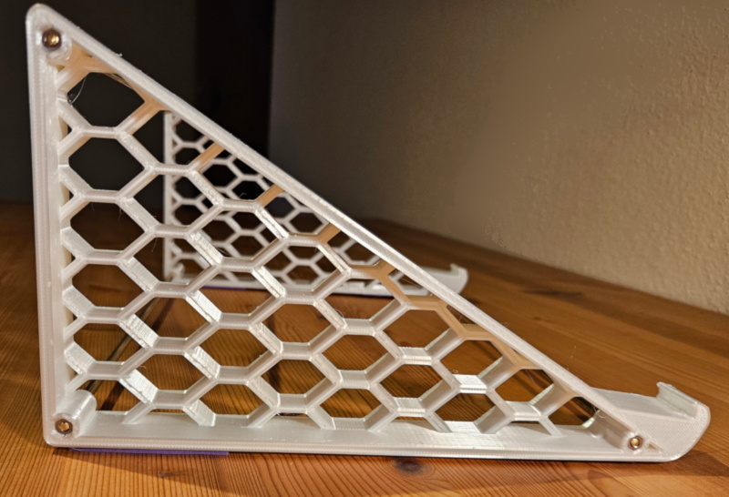
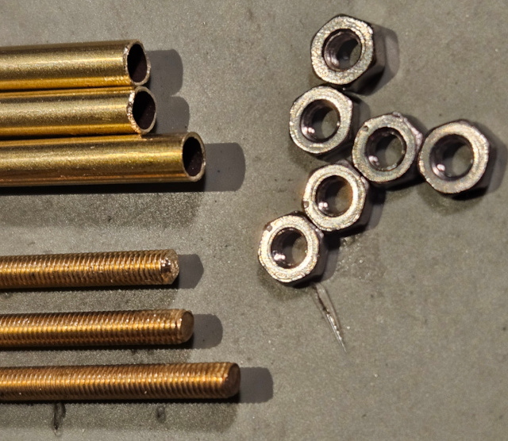
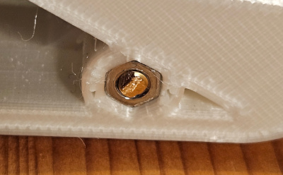
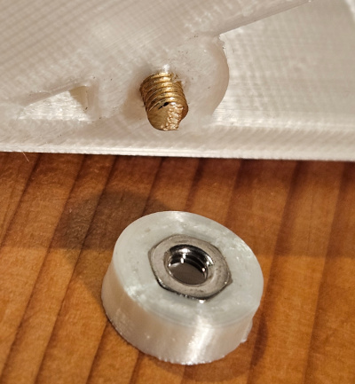

# HPProBook450G10HighStand
A DIY stand for HP ProBook 450 G10 notebook, which was built from [3d prints](#STL) and some metal parts from a hardware store. The high side of the stand is 13cm high (With rubber feet attached to the bottom) and lifts my notebook display to the same level as my external monitors.

- Height: 13cm
- Width: 28.4cm (could be changed with different [metal parts](#metal-parts))
- Weight: 225g (3d PLA prints ~156g)

## License and copyright
My [3d STL print files](#STL) are licensed under the terms of CC0 [Copyright (c) 2025 codingABI](LICENSE). 

## Appendix

### Metal parts

- 3x brass tubes (Outer diameter 4.0mm, inner diameter >= 3.0mm)
- 3x brass M3 threaded rods with the length of one brass tube plus 2.3cm
- 6x M3 nuts

I used brass tubes with a length of 26cm, but you can use other lengths. The threaded rods are sticked in the brass tubes. 

The M3 nuts on
- the left side will be pressed in the place holders of the [3d left side print](STL/HPProBook450G10HighStandLeftSide.stl) 
- the right side will be pressed the place holders of the three [3d knob prints](STL/HPProBook450G10HighStandKnob.stl) 

### STL

- [Left side](STL/HPProBook450G10HighStandLeftSide.stl)
- [Right side](STL/HPProBook450G10HighStandRightSide.stl)
- [Knob](STL/HPProBook450G10HighStandKnob.stl) (Three printed knobs are needed)

All STL files were created and designed with Tinkercad https://www.tinkercad.com

Printer settings used on my Anycubic Vyper (Thank you **Martin**!): 
- 0.4mm nozzle
- Layer height 0.15mm
- PLA+ silk filament

